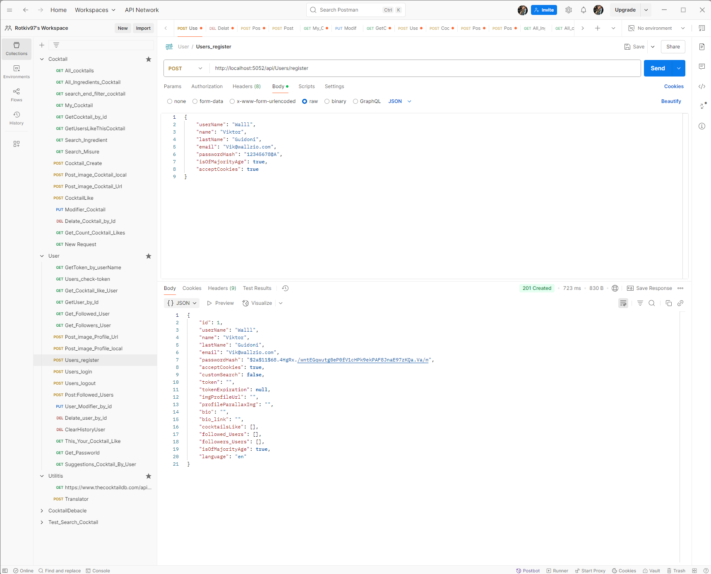
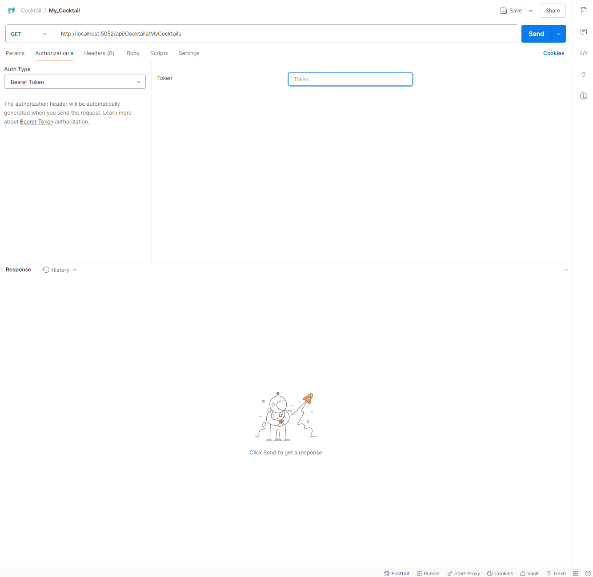

# API del progetto e come testarle su Postman



# Inserise i Token su postoman

# Autenticazione

## Alcune API richiedono un token JWT. Per aggiungerlo in **Postman**:

- Vai nella sezione `Authorization`
- Imposta `Auth Type` su **Bearer Token**
- Inserisci il token dell’utente nel campo `Token`



---

## 🍸 API Cocktail

- [GET - http://localhost:5052/api/Cocktails/cocktails](#get-all-cocktail)
- [GET - http://localhost:5052/api/Cocktails/cocktail/by-id](#cocktail-by-id)
- [GET - http://localhost:5052/api/Cocktails/search](#my-cocktails)
- [GET - http://localhost:5052/api/Cocktails/IngedientSearch/SearchIngredient](#ingredient-search)
- [GET - http://localhost:5052/api/Cocktails/SearchMeasureType/searchMeasure](#search-measure)
- [GET - http://localhost:5052/api/Cocktails/SearchGlass/searchGlass](#search-glass)
- [GET - http://localhost:5052/api/Cocktails/SearchCategory/searchCategory](#search-category)
- [GET - http://localhost:5052/api/Cocktails/GetUserCocktailLikes](#get-user-cocktail-likes)
- [GET - http://localhost:5052/api/Cocktails/GetCountCocktailLikes/{id}](#get-count-cocktail-likes)
- [GET - http://localhost:5052/api/Cocktails/ingredients](#ingredients)
- [GET - http://localhost:5052/api/Cocktails/SearchUser/{username}](#search-user)

- [POST - http://localhost:5052/api/Cocktails/CocktailCreate](#cocktail-create)
- [POST - http://localhost:5052/api/Cocktails/{id}/UploadImageCocktail-local](#upload-image-cocktail-local)
- [POST - http://localhost:5052/api/Cocktails/{id}/UploadImageCocktail-url](#upload-image-cocktail-url)

- [PUT - http://localhost:5052/api/Cocktails/CocktailUpdate/{idDrink}](#cocktail-update)

- [DELETE - http://localhost:5052/api/Cocktails/CocktailDelete/{idDrink}](#cocktail-delete)

## 👤 API Users

- [GET - http://localhost:5052/api/Users/GetUser/{username}](#get-user)
- [GET - http://localhost:5052/api/Users/check-token](#check-token)
- [GET - http://localhost:5052/api/Users/GetToken](#get-token)
- [GET - http://localhost:5052/api/Users/getPassword/{id}](#get-password)
- [GET - http://localhost:5052/api/Users/GetMyCocktailLike/{id}](#get-my-cocktail-like)
- [GET - http://localhost:5052/api/Users/GetFollowedUsers/{id}](#get-followed-users-get)
- [GET - http://localhost:5052/api/Users/GetFollowersUsers/{id}](#get-followers-users)
- [GET - http://localhost:5052/api/Users/Get_Cocktail_for_Followed_Users](#get-cocktails-for-followed-users)
- [GET - http://localhost:5052/api/Users/ThisYourCocktailLike/{id}](#this-is-your-cocktail-like)
- [GET - http://localhost:5052/api/Users/SuggestionsCocktailByUser/{id}](#suggestion-cocktails-by-user)

- [POST - http://localhost:5052/api/Users/login](#login)
- [POST - http://localhost:5052/api/Users/logout](#logout)
- [POST - http://localhost:5052/api/Users/register](#register)
- [POST - http://localhost:5052/api/Users/upload-profile-image-local/{id}](#upload-profile-image-local)
- [POST - http://localhost:5052/api/Users/upload-profile-image-Url/{id}](#upload-profile-image-url)
- [POST - http://localhost:5052/api/Users/FollowedNewUser/{followedUserId}](#followed-new-user-post)

- [PUT - http://localhost:5052/api/Users/{id}](#update-user)

- [DELETE - http://localhost:5052/api/Users/{id}](#delete-user)

## 🌍 API Translation

- [POST - http://localhost:5052/api/Translation/translate](#translation)


### Get All Cocktail

Restituisce **tutti i cocktail** presenti nel database come lista di oggetti `DTO`.

---

### Cocktail By Id

Restituisce un singolo cocktail, identificato da `id`.  
Se l’utente è autenticato e ha accettato i cookie, la ricerca viene **salvata nello storico personale** (`UserHistorySearch`).
Esempio:`/api/Cocktails/cocktail/by-id?id=12`

---

### Search

Permette la ricerca avanzata di cocktail tramite **query param**:

| Parametro     | Descrizione                                  |
|---------------|----------------------------------------------|
| nameCocktail  | Nome del cocktail                            |
| UserSearch    | Username dell’utente creatore del cocktail   |
| glass         | Tipo di bicchiere                            |
| ingredient    | Ingrediente incluso                          |
| category      | Categoria del cocktail                       |
| alcoholic     | Alcoholic / Non Alcoholic / Optional alcohol |
| page          | Numero della pagina                          |
| pageSize      | Elementi per pagina                          |

> Può essere usata con uno o più filtri. Se viene usato solo `UserSearch`, restituisce **una lista di utenti**.

Esempio: `/api/Cocktails/search?ingredient=vodka&page=1&pageSize=10`

---

### My Cocktails

Restituisce tutti i cocktail creati dall'utente attualmente autenticato.
Richiede [Token](#inserise-i-token-su-postoman).

---

### Ingredient Search

Suggerisce ingredienti filtrati in base alla stringa `ingredient`.  
Il risultato dipende dall'età dell’utente (`IsOfMajorityAge`):  
- se sei minorenne: solo ingredienti analcolici
- se sei maggiorenne: tutti

Esempio: `/api/Cocktails/IngredientSearch/SearchIngredient?id={userId}&ingredient={string}`

---

### Search Measure

Suggerisce le unità di misura supportate (es: `ml`, `oz`, `dash`...).  
Filtro opzionale con il parametro `measure`.
Richiede [Token](#inserise-i-token-su-postoman).

Esempio: `/api/Cocktails/SearchMeasureType/searchMeasure?id={userId}&measure={string}`

---

### Search Glass

Suggerisce i tipi di bicchieri disponibili nel database filtrando per nome.
Richiede [Token](#inserise-i-token-su-postoman).

Esempio: `/api/Cocktails/SearchGlass/searchGlass?id={userId}&glass=margarita`

---

### Search Category

Suggerisce le categorie esistenti (es: "Cocktail", "Soft Drink", ecc.), con supporto alla ricerca.
Richiede [Token](#inserise-i-token-su-postoman).

Esempio: `/api/Cocktails/SearchCategory/searchCategory?id={userId}&category=soft`

---

### Get User Cocktail Likes

Restituisce l’elenco degli utenti che hanno messo “like” al cocktail specificato.

Esempio: `/api/Cocktails/GetUserCocktailLikes?id={cocktailId}`

---

### Get Count Cocktail Likes

Restituisce il **numero totale di like** per un cocktail.

Esempio: `/api/Cocktails/GetCountCocktailLikes/{id}`

---

### Ingredients

Restituisce l’elenco **unico e ordinato** di tutti gli ingredienti usati nei cocktail presenti nel database.

Esempio: `/api/Cocktails/ingredients`

---

### Search User

Ricerca utenti filtrando per `username`.  
Funziona solo se sei autenticato [Token](#inserise-i-token-su-postoman).  
Restituisce utenti che iniziano o contengono il nome cercato (escludendo te stesso).

Esempio: `/api/Cocktails/SearchUser/{username}`

---

### Cocktail Create

Permette di **creare un nuovo cocktail**.  
Valida:
- Età (non alcolici se sei minorenne)
- Consistenza tra ingredienti e misure
- Volume massimo consentito in base al bicchiere scelto

Richiede [Token](#inserise-i-token-su-postoman) e JSON del cocktail (`CocktailCreate` DTO).

Esempio: `/api/Cocktails/CocktailCreate`

---

### Upload Image Cocktail local

Carica un'immagine locale per il cocktail (Cloudinary).  
Ed ha bisono del fili caricato [FromFile] file.

Esempio: `/api/Cocktails/{id}/UploadImageCocktail-local`

---

### Upload Image Cocktail Url

Carica un'immagine da URL remoto (es: `https://...`) per un cocktail.
Sostituisce l'immagine precedente se presente.

Esempio: `/api/Cocktails/{id}/UploadImageCocktail-url`

---

### Like

Permette di aggiungere o rimuovere un like a un cocktail.  
Restituisce il numero aggiornato di like.
A bisono del [Token](#inserise-i-token-su-postoman).

Esempio: `/api/Cocktails/like/{id}`

### Cocktail Update

Permette di modificare un cocktail **solo se sei l’autore**.  
Validazione come la creazione (alcolici, misure, volume...).
A bisono del [Token](#inserise-i-token-su-postoman).

Esempio: `/api/Cocktails/CocktailUpdate/{idDrink}`

---

### Cocktail Delete

Elimina un cocktail.  
Accessibile solo dall’utente autore del cocktail.
A bisono del [Token](#inserise-i-token-su-postoman).

Esempio: `/api/Cocktails/CocktailDelete/{idDrink}`

# User Api

---

### Get User

Restituisce i dati di un utente tramite il suo `username`.  
Richiede autenticazione [Token](#inserise-i-token-su-postoman).

Esempio: `http://localhost:5052/api/Users/GetUser/{userName}`

---

### Check Token

Verifica se un token è ancora valido per un determinato `userName`.

Esempio: `http://localhost:5052/api/Users/check-token?userName={userName}`

---

### Get Token

Recupera il token JWT attuale per un utente tramite `userName`.

Esempio: `http://localhost:5052/api/Users/GetToken?userName={userName}`

---

### Get Password

Restituisce la password hashata dell’utente autenticato con il [Token](#inserise-i-token-su-postoman) e passandoli il suo `ID`.

Esempio: `http://localhost:5052/api/Users/getPassword/{id}`

---

### Get My Cocktail Like

Restituisce i cocktail a cui l’utente ha messo like.
Ha bisno del [Token](#inserise-i-token-su-postoman) e dell' `ID` dell'utente.

Esempio: `http://localhost:5052/api/Users/GetMyCocktailLike/{id}`

---

### Get Followed Users (GET)

Restituisce la lista degli utenti seguiti.
Ha bisogno dell' `ID` dell'user e del [Token](#inserise-i-token-su-postoman).

Esempio: `http://localhost:5052/api/Users/GetFollowedUsers/{id}`

---

### Get Followers Users

Restituisce la lista degli utenti che seguono l’utente.
Ha bisogno dell' `ID` dell'user e del [Token](#inserise-i-token-su-postoman).

Esempio: `http://localhost:5052/api/Users/GetFollowersUsers/{id}`

---

### Get Cocktails for Followed Users

Restituisce tutti i cocktail “likati” dagli utenti seguiti.
Ha bisno del [Token](#inserise-i-token-su-postoman).

Esempio: `http://localhost:5052/api/Users/Get_Cocktail_for_Followed_Users`

---

### This Is Your Cocktail Like

Verifica se l’utente autenticato ha messo like a un determinato cocktail.

Esempio: `http://localhost:5052/api/Users/ThisYourCocktailLike/{id}`

---

### Suggestion Cocktails By User

Suggerisce cocktail all’utente in base a:

- `likes`
- `search`
- `category`

Ha bisogno dell' `ID` dell'utente.

Esempio: `http://localhost:5052/api/Users/SuggestionsCocktailByUser/{id}?type=likes&pageSize=10`

---

### Login

Autentica l’utente e restituisce un token JWT.

```json
{
  "userNameRequest": "userName",
  "passwordRequest": "password"
}
```

Esempio: `http://localhost:5052/api/Users/login`

---

### Logout

Invalida il token salvato per l’utente.

```json
{
  "userName": "Vik8"
}
```

Esempio: `http://localhost:5052/api/Users/logout`

---

### Register

Crea un nuovo utente.  
Richiede il seguente JSON nel body (raw):

```json
{
  "userName": "userName",
  "name": "name",
  "lastName": "lastName",
  "email": "caio@comeva.com",
  "passwordHash": "password",
  "acceptCookies": true,
  "isOfMajorityAge": true
}
```

Esempio: `http://localhost:5052/api/Users/register`

---

### Upload Profile Image Local

Carica un’immagine profilo da file locale e la carica su Claudinary.  
Richiede autenticazione [Token](#inserise-i-token-su-postoman).

**Body (form-data)**:

- `file` = [file immagine]

Esempio: `http://localhost:5052/api/Users/upload-profile-image-local/{id}`  

---

### Upload Profile Image URL

Carica un’immagine profilo da un URL remoto e la carica su Claudinary.  
Richiede autenticazione  [Token](#inserise-i-token-su-postoman).
E Richiede `ID` dell'utente.
**Body (raw, JSON)**:

```json
"https://example.com/image.jpg"
```

Esempio: `http://localhost:5052/api/Users/upload-profile-image-Url/{id}`

---

### Followed New User (POST)

Segui o smetti di seguire un altro utente.
Ha bisno del [Token](#inserise-i-token-su-postoman).
Hai bisgno dell'`ID` dell'utente che vuoi seguire.

Esempio: `http://localhost:5052/api/Users/FollowedNewUser/{followedUserId}`

---


### Update User

Modifica i dati dell’utente autenticato.  
Richiede autenticazione [Token](#inserise-i-token-su-postoman).
Hai bisgno dell'`ID` dell'utente.

Body (JSON):

```json
{
  "userName": "Vik8New",
  "name": "Vik",
  "lastName": "New",
  "email": "new@email.com",
  "passwordHash": "newpassword",
  "acceptCookies": false
}
```

Esempio: `http://localhost:5052/api/Users/{id}`

---

### Delete User

Elimina l’utente autenticato [Token](#inserise-i-token-su-postoman).
Hai bisgno dell'`ID` dell'utente.

Esempio: `http://localhost:5052/api/Users/{id}`

---

### Translation

Traduce il testo nella lingua desiderata.

```json
{
  "text": "hello world",
  "toLanguage": "it",
  "fromLanguage": "en"
}
```

Risposta:

```json
{
    "result": "Salve, mondo"
}
```

Esempio: `http://localhost:5052/api/Translation/translate`