# 🍸 CocktailDebacle

🚀 **Progetto full-stack Angular + .NET + SQL Server orchestrato con Docker**

---

## 📦 Avvio del Progetto

È possibile **avviare l’intero progetto** dalla cartella `CocktailDebacle` tramite:

Questo comando:
```bash
docker-compose up --build
```

⚙️ Modalità di Sviluppo
Durante lo sviluppo, i file Angular sono caricati staticamente da un container NGINX.
Per facilitare le modifiche front-end in tempo reale, si deve usare questa modalità:

1. Avvio servizi backend e database su Docker
✅ Avvio parziale dei Docker.
```bash
-docker-compose up sqlserver backend
```
Non è possibile lavorare dinamicamente sul frontend tramite docker di conseguenza:

3. Avvio frontend Angular in locale
```bash
-ng serve --host 0.0.0.0 --poll
```
 (--poll è utile in ambienti dove il file watcher standard non funziona correttamente (es. WSL, Docker Volumes))

🔗 Connessione al Database
Per garantire che il frontend Angular comunichi col database nel container SQL Server, è necessario configurare correttamente la stringa di connessione in:
-CocktailDebacle.Server/appsettings.json

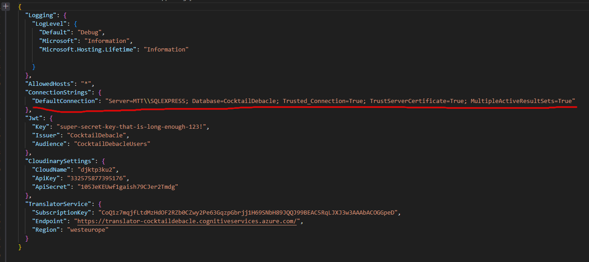

la line di connesione corretta è:
```bash
Server=sqlserver;Database=CocktailDb;User Id=sa;Password=YourStrong!Passw0rd;TrustServerCertificate=true;
```

🧩 Struttura del Frontend (Angular Stand-alone)
Il frontend è realizzato con Angular stand-alone components (senza NgModules), e la loro comunicazione è gestita via:
-app.routes.ts

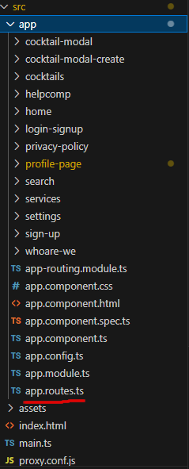

```ts
import { Routes } from '@angular/router';
import { HomeComponent } from './home/home.component';  
import { LoginSignupComponent } from './login-signup/login-signup.component';
import { SignUpComponent } from './sign-up/sign-up.component';
import { PrivacyPolicyComponent } from './privacy-policy/privacy-policy.component';
import { SettingsComponent } from './settings/settings.component';
import { ProfilePageComponent } from './profile-page/profile-page.component';
import { HelpcompComponent } from './helpcomp/helpcomp.component'
import { CocktailsComponent } from './cocktails/cocktails.component';
import { WhoareWeComponent } from './whoare-we/whoare-we.component';
import { inject } from '@angular/core';
import { MatSnackBar } from '@angular/material/snack-bar';
import { Router } from '@angular/router';


export const routes: Routes = [
  { path: '', component: HomeComponent },
  { path: 'home', component: HomeComponent },
  { path: 'profile-page', component: ProfilePageComponent },  
  { path: 'profile-page/:username', component: ProfilePageComponent },  
  { path: 'login-signup', component: LoginSignupComponent },
  { path: 'sign-up', component: SignUpComponent },
  { path: 'privacy-policy', component: PrivacyPolicyComponent },
  { path: 'cocktails', component: CocktailsComponent },
  { path: 'whaw', component: WhoareWeComponent },
  { path: 'help', component: HelpcompComponent },
  { path: 'settings', component: SettingsComponent},
  {
    path: '**',
    resolve: {
      action: () => {
        const snackBar = inject(MatSnackBar);
        const router = inject(Router);
        snackBar.open('Page not found', 'OK', { duration: 3000 });
        router.navigate(['/cocktails']);
      }
    },
    component: ProfilePageComponent,
  }
];

```

🔄 Comunicazione tra componenti
Alcuni componenti sono integrati in altri, come nel caso dei modali:
```ts
app-cocktail-modal 
  *ngIf="selectedCocktail" 
  [cocktail]="selectedCocktail" 
  (close)="selectedCocktail = null">
</app-cocktail-modal>
```

🔌 Chiamate API e Servizi
Le interazioni con il backend per utenti, cocktails, preferenze ecc. sono gestite da services Angular, ad esempio:
```ts
-user.service.ts
export class UserService {
  private apiUrl = 'http://localhost:5052/api/Users';
  private currentUserSubject = new BehaviorSubject<User | null>(null);
  public currentUser$ = this.currentUserSubject.asObservable();

(...)
  constructor(
    private http: HttpClient,
    private router: Router
  ) {
    this.loadUserFromStorage(); 
  }


  getUserByUsername(username: string) {

    const url = this.apiUrl + '/GetUser/' + username;
    
    const token = this.getToken();
    
    const headers = new HttpHeaders({
      'Authorization': 'Bearer ' + token,
      'Content-Type': 'application/json'
    });
  
    
    return this.http.get<any>(url, {headers: headers}).pipe(
      map(response => response), 
      catchError(error => {
        console.error('Errore durante la verifica del login:', error);
        console.error('Stato risposta:', error.status);
        console.error('Messaggio errore:', error.error || error.message);
        return of('404');
      })
    );
  }
(...)
```

📝 Validazione Sign-Up
La fase di registrazione utilizza Validators personalizzati per controllare:

Lunghezza minima/massima

Email valida

Password sicura

Username univoco
```ts
  this.signupForm = this.fb.group({
      FirstName: ['', [Validators.required, Validators.minLength(2), Validators.pattern(/^[a-zA-ZÀ-ÿ\s']+$/)]],
      LastName: ['', [Validators.required, Validators.pattern(/^[a-zA-ZÀ-ÿ\s']+$/)]],
      userName: ['', [Validators.required, Validators.minLength(4), Validators.pattern(/^[a-zA-Z0-9_]+$/)]],
      Email: ['', [Validators.required, Validators.email]],
      ConfirmEmail: ['', [Validators.required, Validators.email]],
      Password: ['', [
        Validators.required,
        Validators.minLength(8),
        Validators.pattern(/^(?=.*[A-Z])(?=.*\d)(?=.*[@$!%*?&])[A-Za-z\d@$!%*?&]+$/)
      ]],
      ConfirmPassword: ['', Validators.required],
      AcceptCookies: [false],
      IsAdult: [false],
    }, {
      validators: [this.checkPasswords, this.checkEmails]
    });    
  }
```

🌍 Traduzioni
Il servizio di traduzione utilizzato è Azure Translator
Limite gratuito: 2 milioni di caratteri/mese

Le traduzioni sono accessibili dalle ⚙️ Impostazioni (dalla pagina Home)
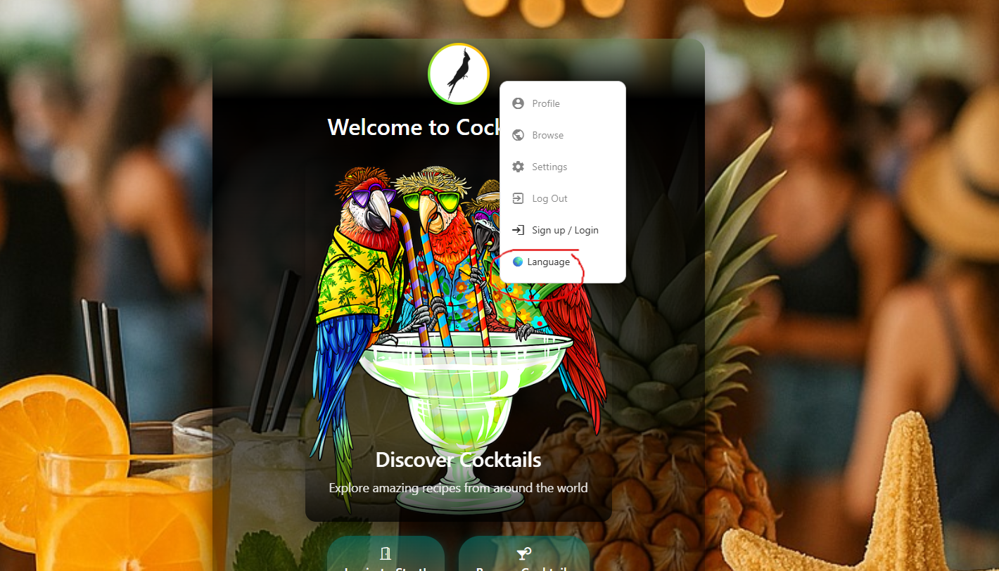

📌 Alcune sezioni sono accessibili solo tramite Footer (condiviso nelle 3 pagine principali):
WhoAreWe

Privacy

Help


🌐 Pagina Browse Cocktails

(mobile)


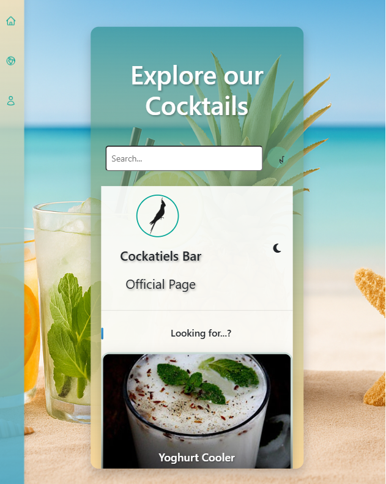

🍹 Browse dei Cocktails

🔍 Funzionalità di ricerca
| Ricerca per         | Disponibile per |
| ------------------- | --------------- |
| Cocktail alcolici   | Utenti loggati  |
| Cocktail analcolici | Tutti           |
| Ingredienti         | Loggati         |
| Persone             | Loggati         |
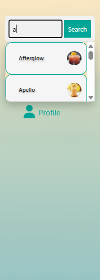

🎠 Caroselli dinamici
Suggerimenti personalizzati (se accettati i cookies)

Basati su età dell’utente

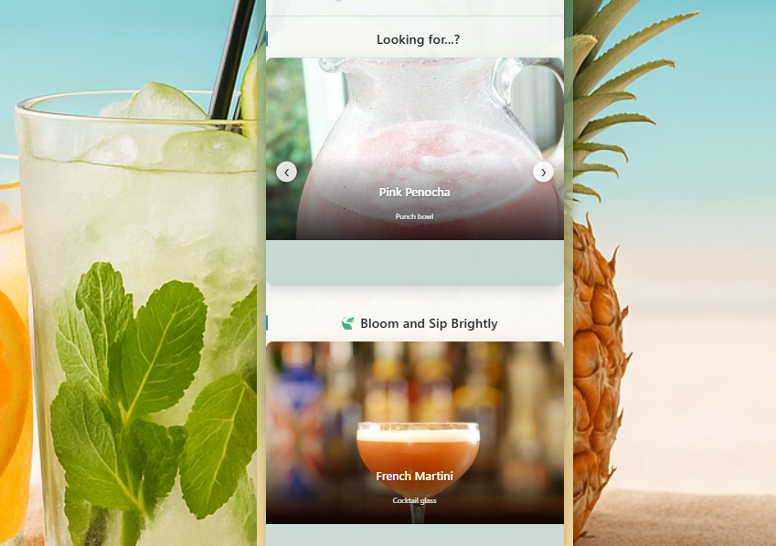

Descrizioni variabili in base a:

🕒 Ora del giorno: mattina / pomeriggio / sera

❄️☀️ Stagione


```ts
    getSeasonalTitleSuggestion() {
      const now = new Date();
      const month = now.getMonth() + 1;

      let season = '';

      if (month >= 3 && month <= 5) {
        season = 'spring';
      } else if (month >= 6 && month <= 8) {
        season = 'summer';
      } else if (month >= 9 && month <= 11) {
        season = 'autumn';
      } else {
        season = 'winter';
      }

        const titles:any = {
          spring: {
            light: [
              '🌸 Fresh Flavors for a New Season',
              '🌞 Wake Up Your Senses This Spring',
              '🍃 Bloom and Sip Brightly'
            ],
            dark: [
              '🌙 Twilight Blooms: Sip in the Shadows',
              '🖤 Night Petals and Cool Vibes',
              '🌌 After-Dusk Drinks with Spring Flair'
            ]
          },
          summer: {
            light: [
              '☀️ Chill Vibes and Citrus Highs',
              '🌴 Taste the Tropics',
              '🍉 Fresh, Cool, and Ready to Pour'
            ],
            dark: [
              '🌅 Sunset Sips for Hot Nights',
              '🌙 Midnight Mojitos and More',
              '🔥 Summer Heat, After Dark'
            ]
          },
          autumn: {
            light: [
              '🍁 Crisp Air, Smooth Flavors',
              '🎃 Spiced Sips for Cozy Moments',
              '☕ Golden Hours & Golden Drinks'
            ],
            dark: [
              '🌌 Fireside Flavors After Dusk',
              '🦉 Nocturnal Notes for Autumn Evenings',
              '🍂 Dark Leaves, Deep Sips'
            ]
          },
          winter: {
            light: [
              '❄️ Light Up Cold Days with Warm Notes',
              '☃️ Chilled Outside, Warm Inside',
              '🍊 Bright Flavors for Frosty Moods'
            ],
            dark: [
              '🌙 Deep Winter, Deep Cocktails',
              '🔥 Bold Spirits for Cold Nights',
              '🌌 Sip by the Firelight'
            ]
          }
        };

        const mode = this.isLightMode ? 'light' : 'dark';
        const seasonalTitles = titles[season][mode];
        const randomIndex = Math.floor(Math.random() * seasonalTitles.length);

        this.suggestedTitle2 = seasonalTitles[randomIndex];
      }

```

🌗 È possibile switchare tra modalità giorno/notte cliccando sull’icona 🌞 / 🌙
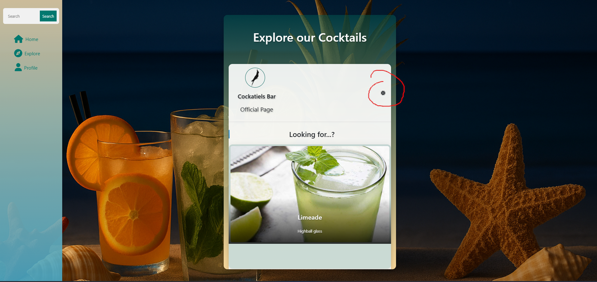


📚 Sidebar di navigazione
Accessibile da:

Pagina Browse Cocktails

Pagina Profilo

Contiene:

🔍 Barra di ricerca

📄 Home

🍸 Browse

👤 Profilo


👤 Pagina Profilo

(accessibile solo se loggati)
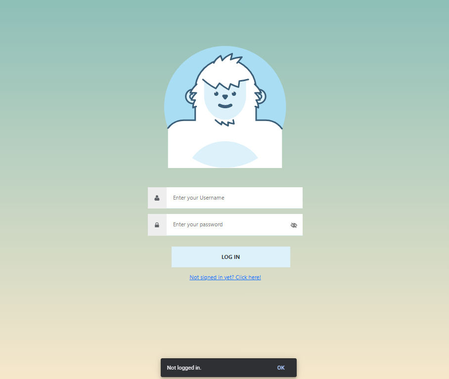

Mostra:

👥 Persone seguite e follower

❤️ Like ai cocktails

📤 Cocktail creati (se pubblici)

📌 Cocktail piaciuti

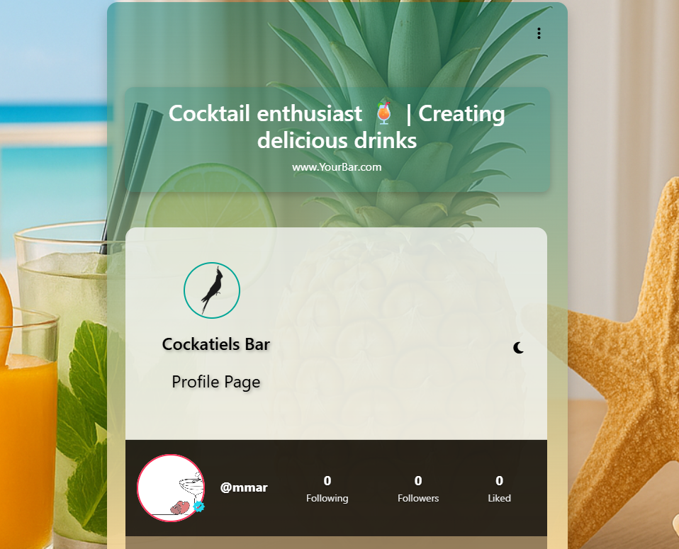

➕ Seguire un utente
Filtra ricerca per Utenti

Cerca il nome

Visualizza il profilo

Premi Segui / Smetti di seguire

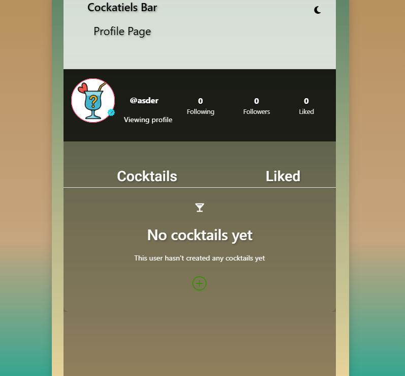


🛠️ Altre funzionalità del Profilo
✨ Creazione Cocktail
📸 Immagine:

❤️ Visualizzazione cocktail piaciuti
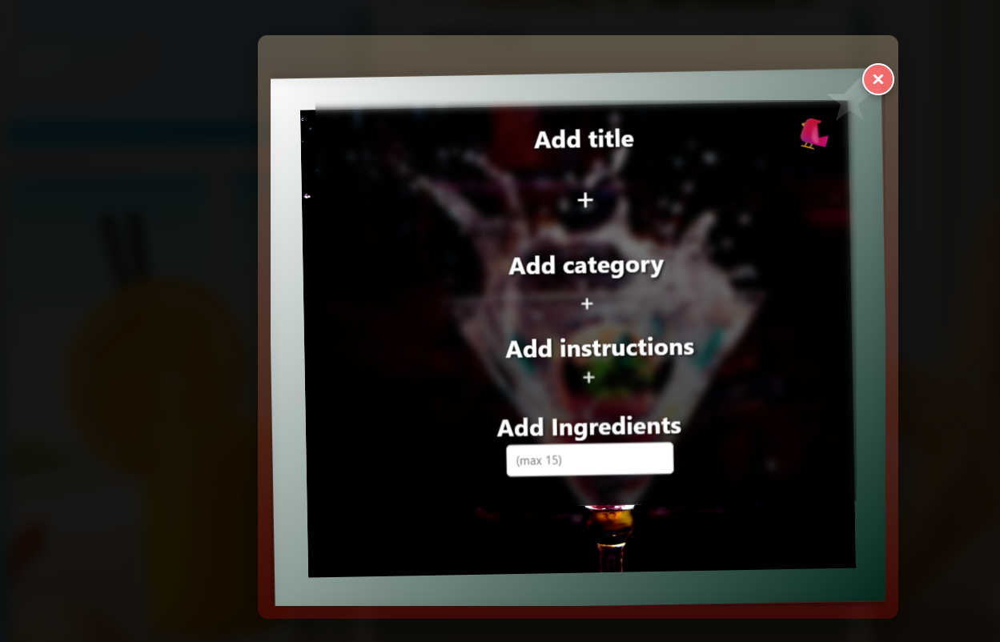

🔧 Impostazioni
Modificabili:

🧑 Nome

📧 Email

🔐 Password

🆔 Username

⚠️ Username e email devono essere unici: in caso contrario viene restituito un errore.

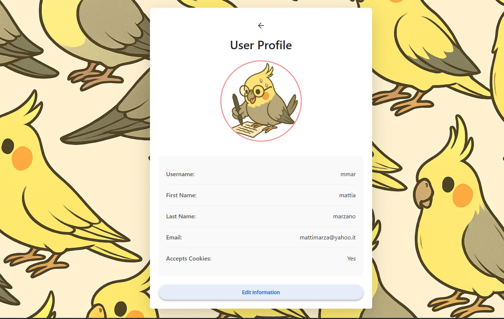


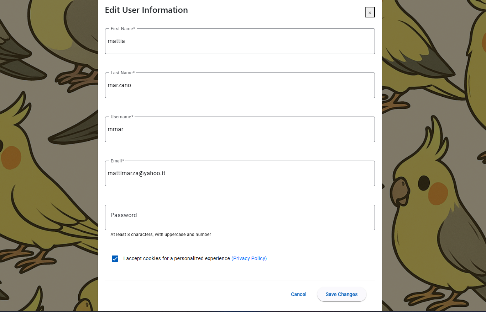


| Componente | Stack                              |
| ---------- | ---------------------------------- |
| Frontend   | Angular 17, Stand-alone components |
| Backend    | .NET Core 7 API                    |
| DB         | SQL Server                         |
| Traduzioni | Azure Translator                   |
| Hosting    | Docker + NGINX                     |
-docker-compose up sqlserver backend
-ng serve --host 0.0.0.0 --poll

------


i cocktails:

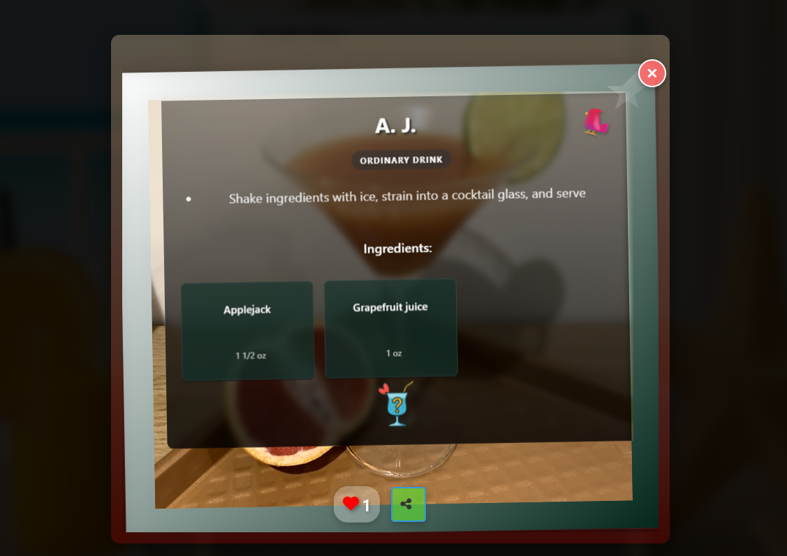

qualche funzionalità profilo:

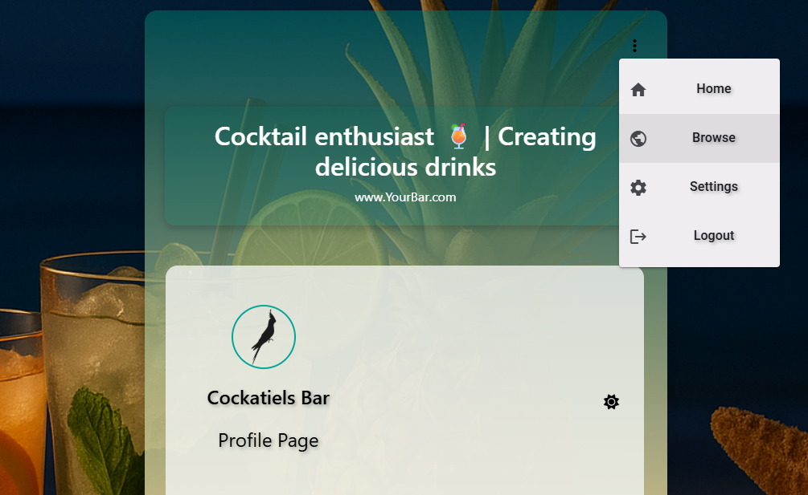

edit del cocktail creato:

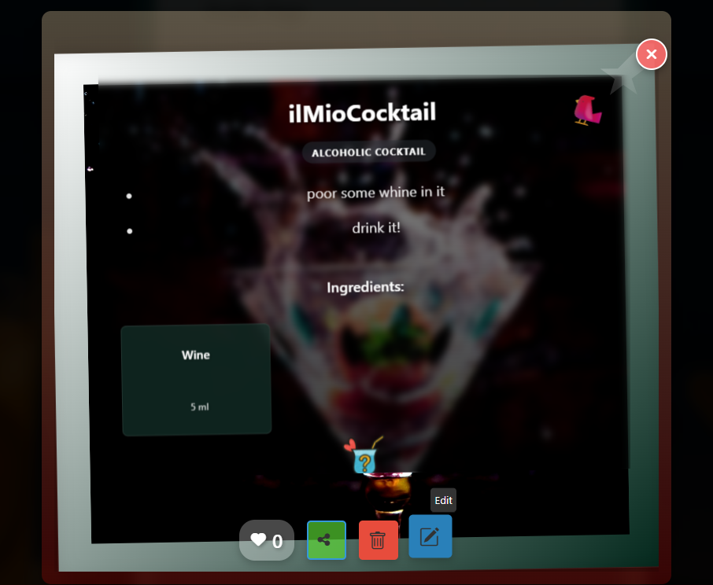

